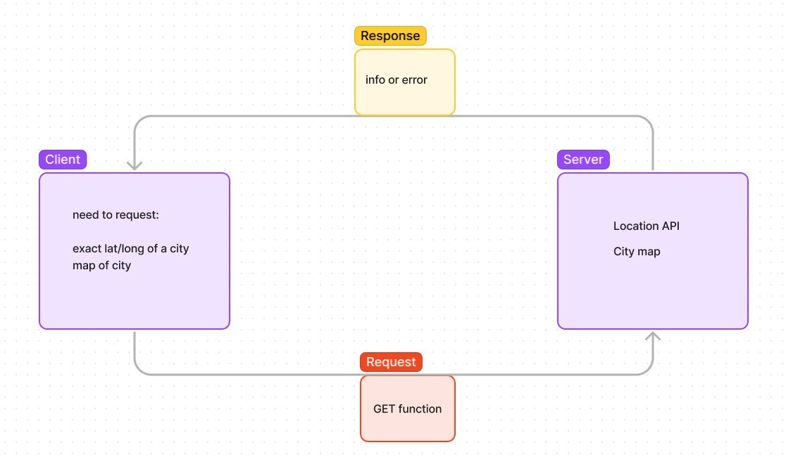

# City-Explorer Lab

**Author**: Erin Ranta
**Version**: 1.0.0 (increment the patch/fix version number if you make more commits past your first submission)

## Overview

This project is to create an app so the user can learn and discover a certain City. The user can use the geographic informtion to determine where places are (and where they are). This app will also include, as  guide to the City, restaurants with their addresses, and movies that were based in/about the City.

## Getting Started

 To get the app on ones own machine they must:

 1. Clone the GitHub Repo
 2. Run npm Install in their terminal
 3. Get an API access token from LocationIQ (after creating an account)
 4. Add API to .env file
 5. Run npm start in terminal

## Architecture

-React Bootstrap (for front-end, visual components)

-Axios for http requests

-LocationIQ API for GPS data.

## Change Log

Time Estimated: 3.5 Hours

Time Started: 9:00

Time Ended: 1:00

Time: 4 hours

## Credit and Collaborations

Day 1 - Mandy Mason and TJ Parker. Also Austin Limanek

